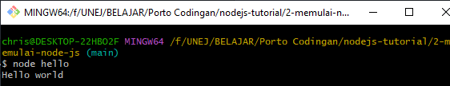

# Memulai NodeJS

Sebelumnya, sudah mencoba untuk coding menggunakan terminal, tetapi ketika dicoba untuk membuat sebuah proyek yang berskala besar, menggunakan terminal bukanlah solusi yang efektif untuk mengerjakan tugas tersebut, maka perlu file-file khusus untuk meletakkan codingan kita

File pertama yang kita buat adalah hello.js.

Untuk menjalankan code pada file hello.js, cukup mengetikkan ```node [NAMAFILETANPAJSBISA]``` lalu Enter. Hasilnya adalah...

