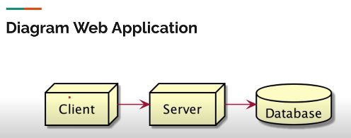

# Web Application

- Web Application adalah aplikasi yang berjalan di Server dan ditampilkan di Browser Client.
- Bagian Web Application antara lain Client, Server, Database.



```
Keterangan:
Client akan melakukan komunikasi seperti request ke server. Server akan mengelola request dan menyimpan data ke Database.
```
