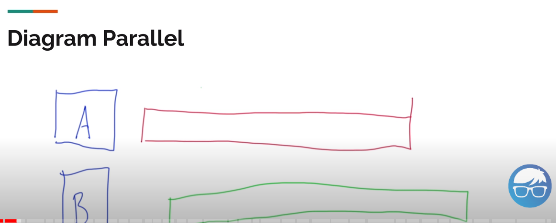
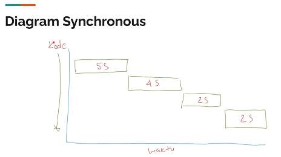
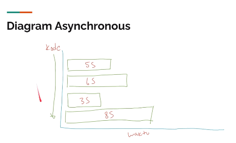

# Sejarah

- Dulu, komputer hanya menjalankan sebuah program pada satu waktu contohnya dulu kalau kita ingin mendengarkan musik, maka program yang dijalankan di komputer hanyalah musik saja dan tidak bisa membuka program lain secara bersamaan.
- Seiring perkembangan zaman, sistem operasi untuk komputer bisa menjalankan program secara bersamaan dalam proses yang berbeda-beda, terisolasi dan saling independen antar program.

# Thread

- Program biasanya berjalan dalam sebuah proses dan memiliki resource yang independent dengan proses lain misalnya Chrome memakan memori 500mb, maka memori yang dikonsumsi hanya untuk Chrome saja dan tidak untuk program apapun.
- OS sekarang tidak hanya bisa menjalankan multiple process, namun bisa menjalankan banyak pekerjaan sekaligus (proses ringan => Thread).
- Thread membuat proses aplikasi berjalan tidak harus sequantial melainkan bisa asynchronous atau parallel.
- Setiap thread berisikan satu task.

# Concurrency & Parallel

- Concurrency adalah menjalankan beberapa pekerjaan satu per satu.
- Parallel adalah menjalankan beberapa pekerjaan sekaligus pada satu waktu

Contoh:

- Browser adalah aplikasi yang concurrent dan paralel.
- Concurrent saat browser terbuka, browser akan melakukan http request lalu mendownload semua file html,css,js lalu dirender dalam bentuk tampilan.
- Parallel saat kita membuka beberapa tab web sambil membuka halaman lain.

# Synchronous & Asynchronous

- Sync adalah ketika kode program berjalan secara sequential dan semua tahapan ditunggu sampai selesai.
- Async adalah ketika kode program berjalan tanpa perlu menunggu eksekusi kode program selesai, kita bisa lanjut ke kode program berikutnya.

