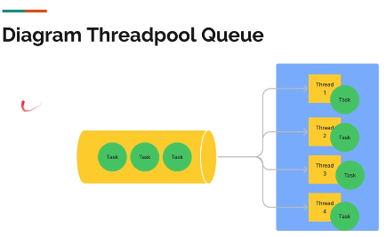

# Threadpool

- Threadpool atau thread management adalah tempat untuk menyimpan thread karena jika thread yang dibuat terlalu banyak (thread dibuat ketika program dijalankan). Ketika kita membutuhkan threadnya, kita bisa ambil dan jika selesai kita kembalikan ke threadpool.
- Dengan ini, kita bisa memanfaatkan thread yang sama berkali-kali tanpa membuat thread baru terus-menerus.

# Threadpool Queue

- Di dalam threadpool terdapat batasan jumlah thread yang dapat masuk ke dalam threadpool. Semisal total maksimal ada 4 thread dan di dalam threadpool, semua thread mempunyai tasknya masing-masing. Ketika kita memiliki task dan ingin memanggil salah satu thread untuk mengelola task tetapi threadnya sibuk semua, maka tugas yang belum dikerjakan dimasukkan ke dalam tempat yang disebut antrian (queue).
- Jika sudah ada thread yang kosong, maka task yang ada di antrian bisa dikerjakan oleh thread tersebut.

