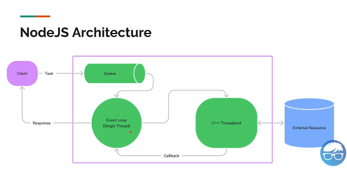

# Arsitektur NodeJS

- Client mengirim tugas -> Tugas dikirim ke queue -> tugas dari queue dikirim dan dikerjakan oleh Event Loop di NodeJS yang Single Thread satu per satu -> Setelah dikerjakan, dari Event Loop task dikirim ke C++ Threadpool -> C++ threadpool mengirim callback ke Event Loop -> Response dari Event Loop dikirim ke Client
- Akhirnya disimpulkan, NodeJS bisa dibilang Single Thread atau Multiple Thread dilihat dari sisi Event Loop atau C++ Threadpool.

# Event Loop

- Event Loop biasanya dipakai untuk mengerjakan tugas yang sifatnya non-blocking. Jika mengerjakan tugas blocking, maka menyebabkan eksekusinya lama karena hanya fokus pada kode blockingnya saja.

# C++ Threadpool

- NodeJS menggunakan C++ Threadpool sebagai worker untuk melakukan pekerjaan.
- NodeJS menggunakan Libuv sebagai library untuk mengatur C++ Threadpool. Secara default ada 4 thread yang disiapkan tetapi kita bisa setting menjadi lebih dengan resiko resource yang dikonsumsi lebih besar. Setting di UV_THREADPOOL_SIZE dengan max thread 1024 thread.
